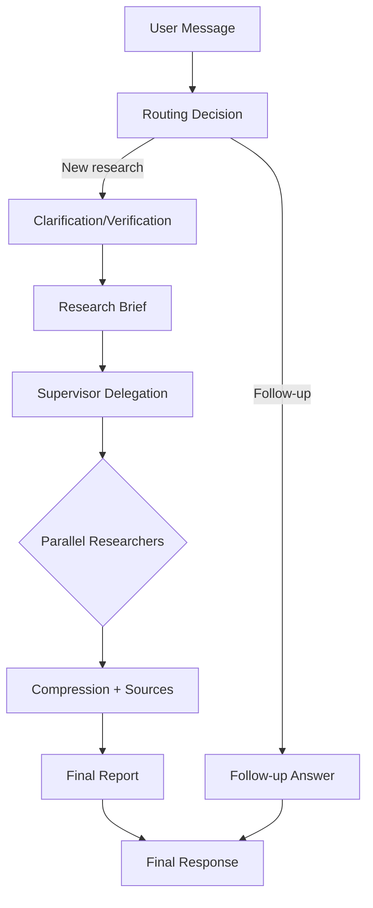
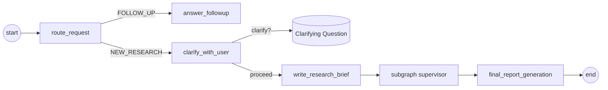

# SynGraph: Deep Research Agent

> **Course:** TNM114 - Artificial Intelligence for Interactive Media  
> **Student:** Berkay Orhan  
> **Date:** October 2025

## Overview

**SynGraph** is a modular, agentic workflow built to perform "Deep Research"—multi-step, iterative investigations that go beyond simple search-and-summarize loops. Built with [LangGraph](https://langchain-ai.github.io/langgraph/) and [Next.js](https://nextjs.org/), it orchestrates a team of AI agents to plan, search, analyze, and synthesize comprehensive reports on complex topics.

This project was developed as part of the TNM114 course at Linköping University. For a detailed technical analysis of the architecture and methodology, please refer to the academic report located at [`report/article.pdf`](report/article.pdf) (generated from `report/article.tex`).

## Key Features

-   **Supervisor-Worker Architecture**: A central supervisor delegates tasks to specialized researcher agents, allowing for parallel execution and broader topic coverage.
-   **Iterative Research Loop**: Agents perform cycles of searching, reading, and reflecting, mimicking human research workflows.
-   **Human-in-the-Loop**: The system supports "interrupts" for clarification. If a request is ambiguous, the agent pauses and asks the user for guidance before proceeding.
-   **Hybrid Model Strategy**:
    -   **Gemini 3 Pro**: Used for deep reasoning, planning, and final report synthesis (leveraging "thinking" capabilities).
    -   **Gemini 2.5 Flash**: Used for high-speed, structured tasks like routing and summarization.
-   **Dual Search Engines**: Integrates **Tavily** for broad web coverage and **Exa** for semantic/academic search.
-   **Typed State Management**: Strictly typed graph state ensures reliability and transparent data flow.

## Architecture

The core of the application is a Directed Cyclic Graph (DCG) that manages the lifecycle of a research request.



### Workflow Steps
1.  **Routing**: Determines if the user input is a new request or a follow-up.
2.  **Clarification**: Analyzes the request for ambiguity. If needed, it pauses to ask the user clarifying questions.
3.  **Research Brief**: Synthesizes a detailed plan and instructions.
4.  **Research & Supervision**: The Supervisor node delegates sub-topics to Researcher nodes. These nodes execute targeted searches and refine their findings.
5.  **Report Generation**: Aggregates all findings into a cohesive, cited report.



## Getting Started

### Prerequisites
-   Node.js (v18+ recommended)
-   API Keys for:
    -   Google GenAI (Gemini)
    -   Tavily
    -   Exa (optional but recommended)

### Installation

1.  Clone the repository:
    ```bash
    git clone https://github.com/berkay2002/researcher.git
    cd researcher
    ```

2.  Install dependencies:
    ```bash
    npm install
    ```

3.  Set up environment variables:
    Create a `.env.local` file in the root directory and add your keys:
    ```env
    GOOGLE_API_KEY=...
    TAVILY_API_KEY=...
    EXA_API_KEY=...
    ```

### Running the Project

To start the Next.js application and the LangGraph server concurrently:

```bash
npm run dev:all
```

-   **Web Interface**: Visit `http://localhost:3000` to interact with the agent.
-   **LangGraph Studio**: Run `npm run dev:langgraph` to launch the studio for visualizing and debugging the graph execution.

## Project Structure

-   `src/server/workflows/deep-research/`: Core LangGraph logic (nodes, edges, state).
-   `src/components/`: React components for the chat interface and artifact rendering.
-   `report/`: Contains the LaTeX source and figures for the project report.
-   `docs/`: Additional documentation on specific implementation details.

## Acknowledgments

Thanks to the LangChain and LangGraph teams for their excellent framework and documentation, which served as the foundation for this project.
