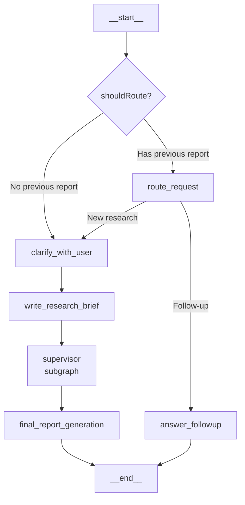

# Deep Research Workflow Documentation

## Overview

The Deep Research workflow is a sophisticated AI-powered research system built with LangGraph that conducts comprehensive research on user-defined topics. It leverages multiple specialized agents working in parallel to gather, analyze, and synthesize information from various sources.

## Architecture

The workflow is implemented as a state graph with multiple nodes and subgraphs that coordinate to handle different aspects of the research process:



## Core Components

### 1. Configuration (`configuration.ts`)

The configuration module manages all settings for the deep research system:

- **Search API Configuration**: Supports Tavily and Exa search engines
- **Model Configuration**: Configurable models for different tasks (research, summarization, compression, etc.)
- **Research Parameters**: Controls iteration limits, concurrent research units, and tool call limits
- **MCP Configuration**: Integration with Model Context Protocol servers
- **Middleware Configuration**: Options for model fallback, context editing, and call limits

Key configuration options:
- `max_researcher_iterations`: Maximum number of research iterations (default: 6)
- `max_concurrent_research_units`: Maximum parallel researchers (default: 5)
- `search_api`: Search provider to use (tavily, exa, or none)
- `enable_followup_routing`: Whether to enable follow-up question detection

### 2. Graph State (`graph/state.ts`)

Defines the data structures used throughout the workflow:

- **AgentState**: Main state containing messages, research brief, notes, and final report
- **SupervisorState**: State for the supervisor managing research tasks
- **ResearcherState**: State for individual researchers
- **Structured Outputs**: Zod schemas for tool calls and responses

### 3. Main Graph (`graph/index.ts`)

The main graph orchestrates the entire research workflow with these key nodes:

#### Route Request Node
- Determines if a user message is a follow-up question about existing research or a new research request
- Uses conversation context and confidence scoring to make routing decisions
- Can interrupt the user for clarification when confidence is low

#### Clarify With User Node
- Analyzes user messages to determine if additional clarification is needed
- Can ask clarifying questions before proceeding with research
- Skips clarification if disabled in configuration

#### Write Research Brief Node
- Transforms user messages into a detailed research brief
- Ensures specificity and completeness of the research question

#### Supervisor Subgraph
- Manages the research process by delegating tasks to specialized researchers
- Coordinates parallel research execution
- Determines when research is complete

#### Final Report Generation Node
- Synthesizes all collected research into a comprehensive report
- Handles token limits with model fallback middleware
- Formats the final output with proper citations

## Subgraphs

### 1. Supervisor Subgraph (`subgraphs/supervisor/`)

The supervisor manages the research process:

**Nodes:**
- `supervisor`: Plans and delegates research tasks
- `supervisor_tools`: Executes tool calls (ConductResearch, ResearchComplete)

**Flow:**
1. Supervisor analyzes the research brief
2. Determines if research should be delegated or marked complete
3. Creates specialized researchers for different aspects of the research
4. Collects and combines results from all researchers

### 2. Researcher Subgraph (`subgraphs/researcher/`)

Individual researchers conduct focused research on specific topics:

**Nodes:**
- `researcher`: Conducts research using available tools
- `researcher_tools`: Executes search and reflection tools
- `compress_research`: Consolidates and formats research findings

**Flow:**
1. Researcher receives a specific research topic
2. Uses search tools to gather information
3. Reflects on findings with the think tool
4. Compresses and formats results for synthesis

## Tools (`utils.ts`)

The system provides several tools for research:

#### Search Tools
- **Tavily Search Tool**: Web search optimized for comprehensive, accurate results
- **Exa Search Tool**: Neural search for finding high-quality, relevant content

#### Research Tools
- **Think Tool**: Strategic reflection tool for research planning and assessment
- **Research Complete Tool**: Signals completion of research tasks

#### Utility Functions
- Date formatting for prompts
- Webpage summarization with AI models
- Message processing and formatting

## Prompts (`prompts.ts`)

The system uses carefully crafted prompts for different stages:

#### Request Routing Prompts
- Analyzes user messages to determine follow-up vs. new research
- Uses conversation context for better routing decisions

#### Follow-up Question Handler Prompts
- Guides answering questions about existing research
- Maintains proper citation continuity

#### User Clarification Prompts
- Determines when clarification is needed
- Generates appropriate clarification questions

#### Research Prompts
- Guides the supervisor in delegating research
- Directs individual researchers in their tasks

#### Report Generation Prompts
- Structures the final report generation
- Ensures proper formatting and citations

## Workflow Execution

### New Research Flow

1. **Initial Processing**
   - User submits a research request
   - System checks if this is new research or a follow-up
   - If new research, proceeds to clarification

2. **Clarification (Optional)**
   - System analyzes if clarification is needed
   - May ask questions to refine the research scope
   - Transforms user input into a detailed research brief

3. **Research Execution**
   - Supervisor receives the research brief
   - Creates specialized researchers for different aspects
   - Researchers work in parallel using search tools
   - Each researcher compresses their findings

4. **Report Generation**
   - System synthesizes all research findings
   - Generates a comprehensive final report
   - Includes proper citations and formatting

### Follow-up Flow

1. **Request Analysis**
   - System analyzes the user's follow-up question
   - Determines if it relates to existing research
   - May ask for clarification if uncertain

2. **Response Generation**
   - System answers based on existing research
   - May conduct additional searches if needed
   - Maintains citation continuity with original report

## Configuration Examples

### Basic Configuration

```typescript
const config = {
  search_api: "tavily",
  max_researcher_iterations: 6,
  max_concurrent_research_units: 5,
  research_model: "gemini-2.5-pro",
  final_report_model: "gemini-2.5-pro",
  allow_clarification: true,
  enable_followup_routing: true
};
```

### Advanced Configuration with MCP

```typescript
const config = {
  search_api: "exa",
  max_researcher_iterations: 8,
  max_concurrent_research_units: 3,
  research_model: "gemini-2.5-pro",
  final_report_model: "gemini-2.5-pro",
  allow_clarification: false,
  enable_followup_routing: true,
  mcp_config: {
    url: "https://mcp-server.example.com",
    tools: ["database_query", "api_call"],
    auth_required: true
  },
  use_model_fallback: true,
  fallback_models: ["gemini-flash-latest", "claude-3-haiku"]
};
```

## Error Handling and Resilience

The system includes several mechanisms for handling errors:

1. **Model Fallback Middleware**: Automatically retries with fallback models when encountering token limits
2. **Structured Output Validation**: Ensures all model outputs conform to expected schemas
3. **Timeout Handling**: Prevents hanging operations with configurable timeouts
4. **Interrupt Recovery**: Gracefully handles user interruptions during clarification

## Performance Considerations

1. **Parallel Research**: Multiple researchers work simultaneously to reduce overall research time
2. **Search Result Caching**: Deduplicates search results to avoid redundant work
3. **Content Summarization**: Compresses webpage content to manage token usage
4. **Configurable Limits**: Adjustable iteration and concurrency limits for different use cases

## Integration Points

The deep research system integrates with:

1. **LangGraph**: For graph-based workflow orchestration
2. **Search APIs**: Tavily and Exa for information gathering
3. **LLM Providers**: Configurable models for different tasks
4. **MCP Servers**: For additional tool capabilities
5. **LangChain**: For core agent functionality and middleware

## Best Practices

1. **Configure Appropriate Limits**: Adjust iteration and concurrency limits based on your use case
2. **Choose the Right Search API**: Use Tavily for general searches, Exa for academic/semantic searches
3. **Enable Follow-up Routing**: For better user experience in conversations
4. **Use Model Fallback**: To ensure reliability when dealing with large documents
5. **Provide Clear Research Briefs**: More specific briefs lead to better research outcomes

## Future Enhancements

Potential areas for improvement:

1. **Additional Search Providers**: Support for more specialized search engines
2. **Enhanced Citation Management**: More sophisticated citation formatting and validation
3. **Research Templates**: Pre-configured research patterns for common domains
4. **Custom Tool Integration**: Easier integration of domain-specific tools
5. **Performance Optimization**: Further parallelization and caching improvements