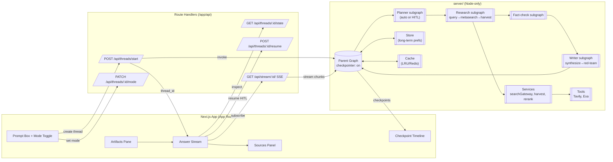
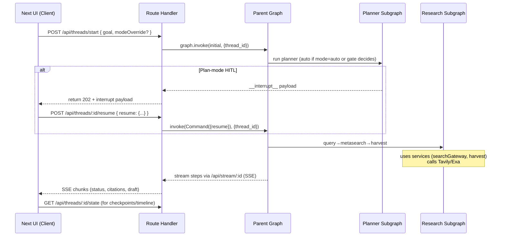

# High-overview architecture (Mermaid)

This document provides the technical implementation details for the research assistant described in the [brief.md](brief.md). For conceptual understanding of LangGraph features used in this implementation, refer to the [LangGraph documentation](documentation/langgraph/01-introduction-quickstart.md).



* **Checkpointer + threads** enable memory, HITL, time-travel, and fault-tolerance; you always invoke with a `thread_id`. See [Persistence documentation](documentation/langgraph/05-persistence.md) for implementation details. ([LangChain AI][1])
* **Subgraphs** encapsulate roles; with shared state keys they naturally "share memory" with the parent. See [Multi-agent systems](documentation/langgraph/11-multi-agent-systems.md) for more details. ([LangChain Docs][2])
* **App Router route handlers** power the API endpoints and SSE stream. ([Next.js][3])

---

# Run sequence (Mermaid sequence diagram)



* **Interrupt/Command** pauses/resumes inside Planner (Plan-mode); stream continues after resume. See [Human-in-the-loop documentation](documentation/langgraph/07-human-in-the-loop.md) for implementation patterns. ([LangChain Docs][4])
* **SSE** fits App Router route handlers for streaming tokens/steps. ([Upstash: Serverless Data Platform][5])

---

# API contracts (App Router)

* **POST `/api/threads/start`** → start a run
  **body** `{ goal: string, modeOverride?: "auto"|"plan", user?: {...} }`
  **resp** `201 { threadId, checkpointId, status }` (or `202` with `__interrupt__` envelope)
  Route handlers & methods are first-class in App Router. ([Next.js][3])

* **GET `/api/stream/:threadId`** (SSE) → live updates (progress, citations, partial draft)
  **headers** `Content-Type: text/event-stream`, `Cache-Control: no-cache` (standard SSE). ([DEV Community][6])

* **GET `/api/threads/:threadId/state`** → latest checkpoint snapshot
  **resp** `{ values, checkpoint_id, next }` (mirrors LangGraph snapshot concepts). ([LangChain AI][1])

* **POST `/api/threads/:threadId/resume`** → resume HITL
  **body** `{ resume: any }` (pass straight to `new Command({ resume })`)

* **PATCH `/api/threads/:threadId/mode`** → UI toggle
  **body** `{ mode: "auto"|"plan" }` (parent graph reads it on next step)

---

# Environment variables

```
TAVILY_API_KEY=...
EXA_API_KEY=...
REDIS_URL=...            # optional
NODE_ENV=development
```

* Tavily base URL: `https://api.tavily.com` (search endpoint: POST `/search`). ([Tavily Docs][7])
* Exa search endpoint: POST `/search`. ([docs.exa.ai][8])

---

# Dependencies (minimal)

```
next react react-dom
zod
@langchain/langgraph
pino
```

(Optionally add `ioredis` or `upstash/redis` for cache/store; Tailwind + shadcn/ui for UI.)

---

# Minimal server scaffolding (copy/paste to start)

**`src/server/graph/index.ts`** – build parent graph with checkpointer

```ts
import { StateGraph, START, END, MemorySaver, Annotation } from "@langchain/langgraph";
import { planGate } from "./nodes/planGate";
import { buildPlannerSubgraph } from "./subgraphs/planner";
import { buildResearchSubgraph } from "./subgraphs/research";
import { buildFactcheckSubgraph } from "./subgraphs/factcheck";
import { buildWriterSubgraph } from "./subgraphs/writer";

// Define parent state using Annotation.Root (alpha-1.0 pattern)
const ParentStateAnnotation = Annotation.Root({
  threadId: Annotation<string>({ reducer: (_, next) => next }),
  userInputs: Annotation<{ goal: string; modeOverride?: "auto" | "plan" }>({
    reducer: (prev, next) => ({ ...prev, ...next }),
  }),
  plan: Annotation<object | null>({
    reducer: (_, next) => next,
    default: () => null,
  }),
  queries: Annotation<string[]>({
    reducer: (prev, next) => [...(prev ?? []), ...next],
    default: () => [],
  }),
  // ... other state keys (searchResults, evidence, draft, issues)
});

let compiled: ReturnType<typeof buildParentGraph> | null = null;

function buildParentGraph() {
  const planner = buildPlannerSubgraph();
  const research = buildResearchSubgraph();
  const factcheck = buildFactcheckSubgraph();
  const writer = buildWriterSubgraph();

  const builder = new StateGraph(ParentStateAnnotation)
    .addNode("planGate", planGate)
    .addNode("planner", planner)
    .addNode("research", research)
    .addNode("factcheck", factcheck)
    .addNode("writer", writer)
    .addEdge(START, "planGate")
    .addEdge("planGate", "planner")
    .addEdge("planner", "research")
    .addEdge("research", "factcheck")
    .addEdge("factcheck", "writer")
    .addEdge("writer", END);

  return builder.compile({ checkpointer: new MemorySaver() }); // threads & memory
}

export function getGraph() {
  if (!compiled) {
    compiled = buildParentGraph();
  }
  return compiled;
}
```

* Subgraphs use `ParentStateAnnotation` to inherit state schema and reducers. Checkpointer persists thread state automatically. ([LangChain Docs][2])

**`src/app/api/threads/start/route.ts`** – start a run

```ts
import { NextRequest, NextResponse } from "next/server";
import { v4 as uuid } from "uuid";
import { getGraph } from "@/server/graph";
import { Command } from "@langchain/langgraph";

export async function POST(req: NextRequest) {
  const body = await req.json();
  const threadId = body.threadId ?? uuid();
  const graph = getGraph();

  const initial = {
    threadId,
    userInputs: { goal: body.goal, modeOverride: body.modeOverride ?? null }
  };

  const result = await graph.invoke(initial, { configurable: { thread_id: threadId } });

  // If planner hit an interrupt (Plan-mode), return it so UI can render options.
  if ((result as any).__interrupt__) {
    return NextResponse.json(
      { threadId, interrupt: (result as any).__interrupt__ },
      { status: 202 }
    );
  }

  return NextResponse.json({ threadId, status: "started" }, { status: 201 });
}
```

* Route handlers live under `app/api/...` and support all HTTP methods. ([Next.js][3])

**`src/app/api/threads/[threadId]/resume/route.ts`** – resume HITL

```ts
import { NextRequest, NextResponse } from "next/server";
import { getGraph } from "@/server/graph";
import { Command } from "@langchain/langgraph";

export async function POST(req: NextRequest, { params }: { params: { threadId: string }}) {
  const body = await req.json();
  const graph = getGraph();
  const out = await graph.invoke(new Command({ resume: body.resume }), {
    configurable: { thread_id: params.threadId }
  });
  return NextResponse.json({ ok: true, checkpointId: (out as any).__checkpoint_id ?? null });
}
```

**`src/app/api/threads/[threadId]/state/route.ts`** – get latest state (for timeline)

```ts
import { NextRequest, NextResponse } from "next/server";
import { getGraph } from "@/server/graph";

export async function GET(_: NextRequest, { params }: { params: { threadId: string }}) {
  const graph = getGraph();
  const snap = await graph.getState({ configurable: { thread_id: params.threadId } });
  return NextResponse.json({ values: snap.values, next: snap.next ?? [], checkpointId: (snap as any).checkpoint_id ?? null });
}
```

**`src/app/api/stream/[threadId]/route.ts`** – SSE stream (progress/draft deltas)

```ts
import { NextRequest } from "next/server";
import { getGraph } from "@/server/graph";

export const runtime = "nodejs"; // ensure Node runtime for SSE

export async function GET(_: NextRequest, { params }: { params: { threadId: string }}) {
  const graph = getGraph();

  // Use streamMode: "updates" for step-by-step progress (alpha-1.0 pattern)
  // Other modes: "messages" (LLM tokens), "custom" (user-defined), or ["updates", "messages"]
  const stream = await graph.stream(
    null,
    {
      configurable: { thread_id: params.threadId },
      streamMode: "updates" // or ["updates", "messages", "custom"]
    }
  );

  // Create SSE response
  const encoder = new TextEncoder();
  const body = new ReadableStream({
    async start(controller) {
      for await (const chunk of stream) {
        controller.enqueue(encoder.encode(`data: ${JSON.stringify(chunk)}\n\n`));
      }
      controller.enqueue(encoder.encode("event: end\ndata: {}\n\n"));
      controller.close();
    }
  });

  return new Response(body, {
    headers: {
      "Content-Type": "text/event-stream",
      "Cache-Control": "no-cache, no-transform",
      Connection: "keep-alive"
    }
  });
}
```

* Alpha-1.0 streaming uses `streamMode` parameter: `"updates"` (agent progress), `"messages"` (LLM tokens), `"custom"` (user-defined). See [Streaming documentation](documentation/langgraph/09-streaming.md). ([Upstash: Serverless Data Platform][5])

**Tavily/Exa stubs** (server-only; you already planned these)

```ts
// server/tools/tavily.ts
export async function tavilySearch(query: string) {
  const res = await fetch("https://api.tavily.com/search", {
    method: "POST",
    headers: {
      "Content-Type": "application/json",
      "Authorization": `Bearer ${process.env.TAVILY_API_KEY!}`
    },
    body: JSON.stringify({ query, max_results: 8, search_depth: "basic" })
  });
  return res.json();
}
```

```ts
// server/tools/exa.ts
export async function exaSearch(query: string) {
  const res = await fetch("https://api.exa.ai/search", {
    method: "POST",
    headers: {
      "Content-Type": "application/json",
      "x-api-key": process.env.EXA_API_KEY!
    },
    body: JSON.stringify({ query, numResults: 8 })
  });
  return res.json();
}
```

* Tavily and Exa endpoints & behavior from their docs. ([Tavily Docs][7])

---

# What else you need (quick checklist)

* **App Router wiring**: base `layout.tsx`, dashboard shell, pages for `/research/new` and `/research/[threadId]`. ([Next.js][9])
* **Client hooks**: `useThread` (create thread + connect SSE), `useResume` (post Command resume).
* **Sources panel** UI that subscribes to SSE chunks, groups citations by claim, and links out.
* **Mode switch** writes to `/api/threads/:id/mode` *and* sets `userInputs.modeOverride` for immediate effect.
* **Tests**: minimal contract tests for start/resume/state; a snapshot of a planner interrupt payload.
* **.env** with Tavily/Exa keys; verify Node runtime for streaming routes.

[1]: https://langchain-ai.github.io/langgraph/concepts/persistence/?utm_source=chatgpt.com "LangGraph persistence - GitHub Pages"
[2]: https://docs.langchain.com/oss/javascript/langgraph/use-subgraphs?utm_source=chatgpt.com "Use subgraphs - Docs by LangChain"
[3]: https://nextjs.org/docs/app/getting-started/route-handlers-and-middleware?utm_source=chatgpt.com "Getting Started: Route Handlers and Middleware"
[4]: https://docs.langchain.com/oss/python/langgraph/add-human-in-the-loop?utm_source=chatgpt.com "Enable human intervention - Docs by LangChain"
[5]: https://upstash.com/blog/sse-streaming-llm-responses?utm_source=chatgpt.com "Using Server-Sent Events (SSE) to stream LLM responses ..."
[6]: https://dev.to/serifcolakel/real-time-data-streaming-with-server-sent-events-sse-1gb2?utm_source=chatgpt.com "Real-Time Data Streaming with Server-Sent Events (SSE)"
[7]: https://docs.tavily.com/documentation/api-reference/introduction?utm_source=chatgpt.com "Introduction"
[8]: https://docs.exa.ai/reference/search?utm_source=chatgpt.com "Search"
[9]: https://nextjs.org/docs/app?utm_source=chatgpt.com "Next.js Docs: App Router"
